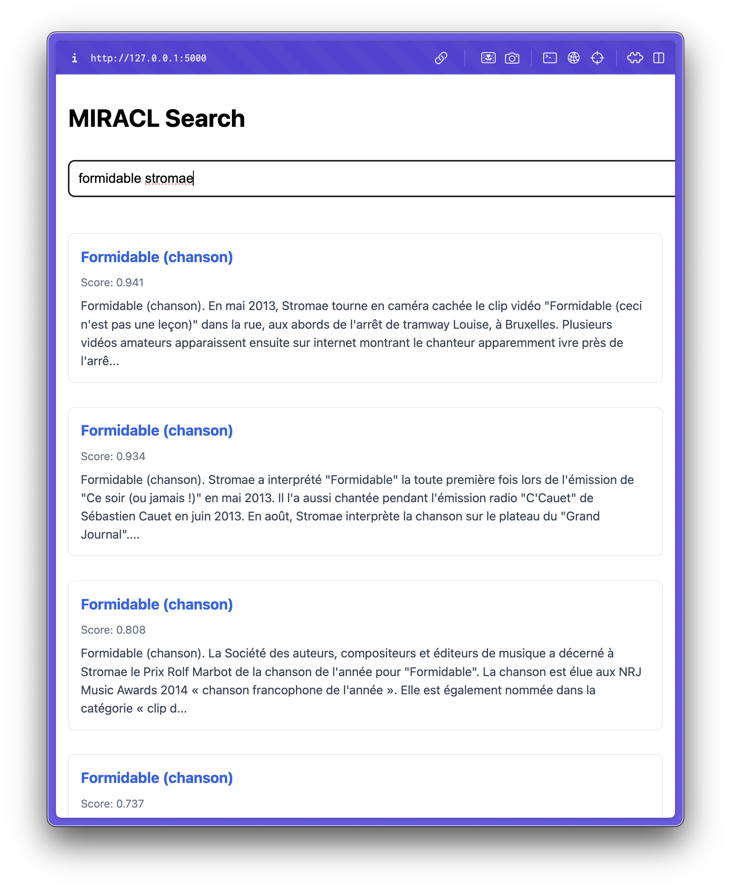

# MIRACL Cross-Encoder (fr)

This model is a fine-tuned version of [antoinelouis/crossencoder-camembert-base-mmarcoFR](https://huggingface.co/antoinelouis/crossencoder-camembert-base-mmarcoFR) on the MIRACL dataset for fr language. It uses hard negative mining with BM25 for better training data.

## Training
- The model was trained on MIRACL fr dataset
- Hard negative mining was performed using BM25
- For each query, we used all positive passages and up to 30 negative passages (combination of original negatives and BM25 hard negatives)

## Performance
The model was evaluated against several other models at re-ranking top-1k BM25 results and the following results were obtained:

| Model                                      | P@1    | P@10   | AP@10  | nDCG@10 |
|--------------------------------------------|--------|--------|--------|---------|
| BM25                                       | 0.1370 | 0.0560 | 0.1303 | 0.1832  |
| mcontriever-msmarco                        | 0.1603 | 0.0755 | 0.1798 | 0.2525  |
| mdpr-tied-pft-msmarco                      | 0.1370 | 0.0726 | 0.1630 | 0.2341  |
| mdpr-tied-pft-msmarco-ft-miracl-fr         | 0.1778 | 0.0866 | 0.2052 | 0.2855  |
| camembert-base-mmarcoFR | 0.4169 | 0.1239 | 0.3728 | 0.4688  |
| this model | 0.4869 | 0.1327 | 0.4349 | 0.5245  |


## Usage
### Install dependencies
```
pip install -U sentence-transformers datasets flask retriv
```

### Run
Model weights are [uploaded to huggingface](https://huggingface.co/azat-serikbayev/crossencoder-camembert-base-mmarcoFR-miracl-fr) and can be used as follows:
```python
from sentence_transformers.cross_encoder import CrossEncoder

model = CrossEncoder("azat-serikbayev/crossencoder-camembert-base-mmarcoFR-miracl-fr")
scores = model.predict([["query", "document_text"]])
```

You can also run `python server.py` to execute some queries. Warning: high disk and RAM usage.


